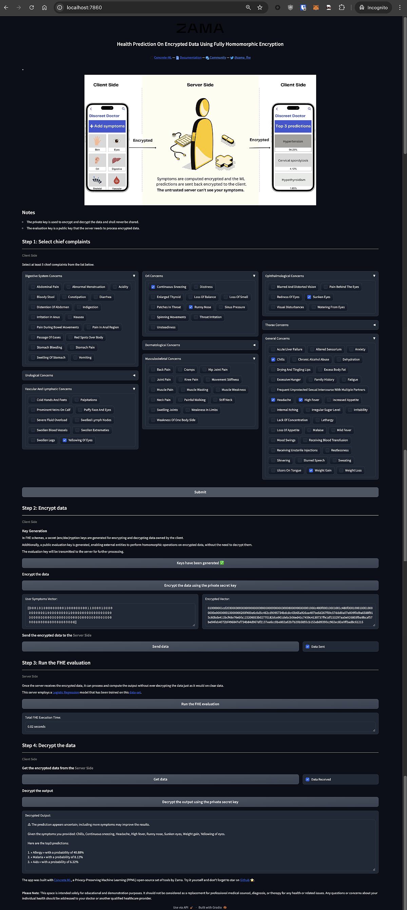

# Health Prediction w/ Homomorphic Encryption

**Health Prediction On Encrypted Data W/ Fully Homomorphic Encryption**

Homomorphic Encryption ( HE ) is a type of encryption that allows you to perform operations on encrypted values and produce encrypted outputs in such a way so that the outputs, if decrypted, will be equal to the output of the same set of operations performed on the un-encrypted values.



---

## Run

```sh
./start.sh
```

## Execute Once Before All Launch

Create a virtual env and activate it:

```sh
python3.10 -m venv .venv # Python 3.10.14
source .venv/bin/activate
```

Install required packages:

```sh
pip install pip --upgrade
pip install -U pip wheel setuptools --ignore-installed
pip install -r requirements.txt --ignore-installed
```

Generating deployment files:

```sh
python dev.py
```

After running this command, the two folders will be populated, more exactly **`./data/`** ( with **`Testing.csv`**, **`Testing_preprocessed.csv`**, **`Training.csv`** and **`Training_preprocessed.csv`** ) and **`./deployment_files/`** ( with **`client.zip`**, **`server.zip`** and **`versions.json`** ).

---

## Launch The Application

In your terminal, run:

```sh
source .venv/bin/activate
python3 app.py
```

---

## Interacting With The Application

Open the given URL link ( search for a line like Running on local URL: **`http://127.0.0.1:7860/`** ).

---

---
